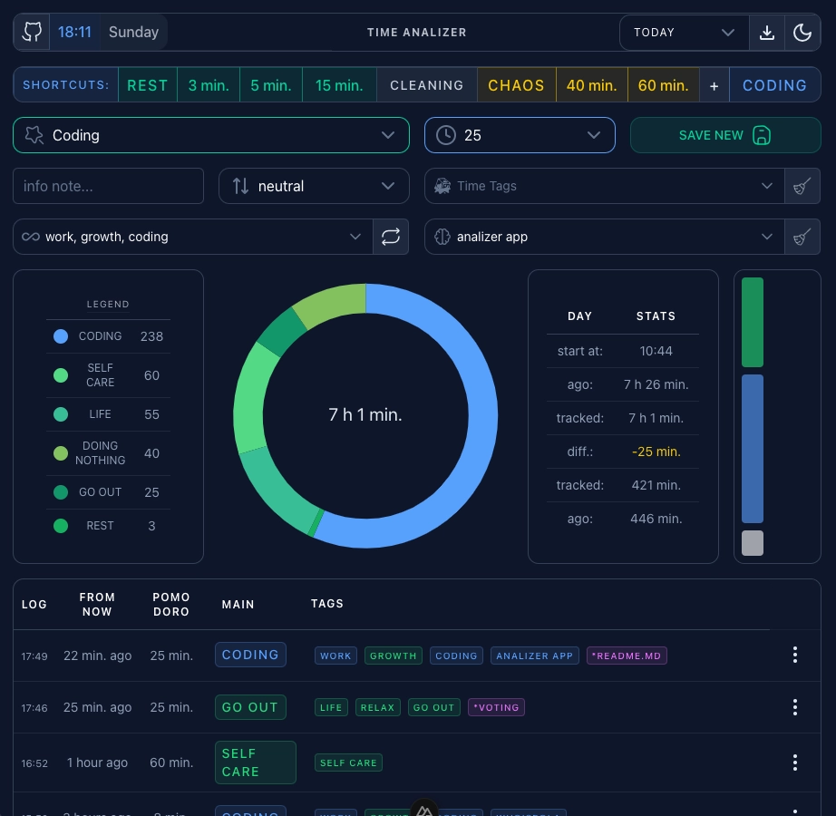

# ADHD Time Analyzer

A more descriptive name would be: **"Anti-drift away ADHD Pomodoro time tracker."**
I looked for a similar free app, tried various Notion and Obsidian extensions, but found nothing. So, here it is.

> ⚠️ This is a **work-in-progress** version.

The main purpose of this project is to practice using **Nuxt Layers**.  
Eventually, I’d like to experiment with **various UI libraries**, and possibly also try out **different cloud backends**.  
The current version is based on **Firebase**, using **Auth**, **Firestore**, and includes **several layout options** to choose from.

Alternatively, there's a demo version **without Firebase** — in that case, logs are stored in the browser’s **local storage**.  
You can download your logs as a `.json` file using the button in the UI.  
Logs are optimized, so I estimate that **5MB of local storage** should be enough to store a few months of data.

## DEMO: [demo-adhd.pagetailoring.com](https://demo-adhd.pagetailoring.com/)

## App Purpose

This app will probably only make sense to someone with ADHD — someone who knows what it’s like to sit at a computer, completely forget about the world, food, or water, and stay there for hours.

A well-known method that helps with this is the [Pomodoro Technique](https://en.wikipedia.org/wiki/Pomodoro_Technique).  
Unfortunately, when you have ADHD, you often either forget to start the timer or keep restarting it like hitting the snooze button on an alarm clock. You lose track of how long you've actually been working — or not working.

_I built this app for myself to help with exactly that._

## Nuxt Layers

- **ANALYZER**: `Main app logic layer` — all logic and calculations are handled in Pinia stores to keep logic UI-agnostic
- app: Application Entry Layer for build
- firebase-analyzer: Composables connecting the `analyzer` logic with Firebase, and `app.vue` used when Firebase is enabled
- firebase: Firebase Layer, with:
  - Plugins: Initialization of Firebase app and authentication
  - Pinia Store: Manages authentication state
  - Components: Related to authentication UI and logic
  - Composables: Handle authentication and Firestore operations
- firebase-noop: `Noop` fallback layer used when Firebase is disabled, with `app.vue`
- theme-nuxt-ui: Layer with demo page, the most refined and stable base theme
- theme-vuetify: MVP (work in progress)
- theme-prime-vue: MVP
- theme-noop: `Noop` fallback theme

## Logic in a nutshell

- `effective day start`: The first logs added during the day, with no more than a 2-minute gap between them, are counted as a streak to calculate this variable.
- `effective night gap auto detect`: Searches for a potential gap between logs after midnight and the `day start` to determine which logs belong to which day for statistics.
- The logic for dividing logs between days is in `useEdgeCases`.
- Variables used in the logic can be found in `~/analyzer/utils/config/logic.ts`.
- The statistics for today show the current tracked minutes since the beginning of the day and the variance between the tracked time and the time from the `effective day start`.
- Statistics for previous days are already simplified.

_I'll write more about this here someday._

> 🙃 The dictionaries used in the app are highly subjective and currently hardcoded in `~/analyzer/data/`.



## Settings

`.env` variables to control the app’s behavior:

```
UI_THEME=nuxtUi | primeVue | vuetify | noop
USE_FIREBASE=false | true
DEMO=true | false
```

You currently have **3 layouts** to choose from.  
On each startup, it also tests the correctness of key settings in the `.env` file.

Each time the app starts, it _regenerates_ the `tsconfig.json` file based on `~/app/tsconfig.settings.json`, to which it automatically adds a generated array for the `exclude` field — based on settings from the appropriate `.env` file,  
as well as values from `nuxt.config.ts` such as **aliases** and **extends** (Layers).

## Development (no-DB version)

As mentioned above, if you're not using Firebase, you can either remove the Firebase layer entirely,
or disable TypeScript strict mode in the `nuxt.config.ts` file of the `App Layer`.

```bash
pnpm install
cd app
pnpm run dev
```

## Development (`Firebase Auth` + `Firestore` version)

Configure your Firebase project at [console.firebase.google.com](https://console.firebase.google.com).  
You will need to create a web app, initialize Authentication with the **Email/Password** sign-in method, create a user, and initialize Firestore.  
Then, download your app's configuration settings and copy them into the `firebaseConfig.ts` file.

Rename `utils/firebaseConfig.example.ts` to `utils/firebaseConfig.ts`, and update it with your app's information.

`.env` variable to control which option is used, turn it on:

```
USE_FIREBASE=true
```

Then, proceed as usual with Nuxt:

```bash
pnpm install
cd app
pnpm run dev
```

Start the development server on [http://localhost:3000](http://localhost:3000)

## Documentations

- Look at the [Nuxt documentation](https://nuxt.com/docs/getting-started/introduction) to learn more.
- Check out the [deployment documentation](https://nuxt.com/docs/getting-started/deployment) for more information.
- [Firebase Authentication](https://firebase.google.com/docs/auth) [web documentation](https://firebase.google.com/docs/auth/web/start)
- [Nuxt UI](https://ui.nuxt.com/)
- [PrimeVue](https://primevue.org/)
- [Vuefity](https://vuetifyjs.com/en/)
- Nuxt Ui using [TanStack Table](https://tanstack.com/table/latest/docs/framework/vue/vue-table#usevuetable) is widely used throughout the project
- [@nuxt/eslint](https://eslint.nuxt.com/packages/module)
- [typescript && vue-tsc](https://nuxt.com/docs/guide/concepts/typescript)
